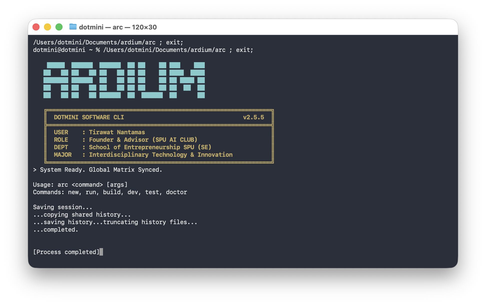

# ⚡ Ardium

**The High-Performance Systems Language with First-Class Native UI.**

 

> **"Performance of C. Simplicity of Python. Native UI of Swift."**

Ardium is a statically-typed, compiled programming language built on **LLVM**. It is designed to bridge the gap between low-level systems programming and high-level application development.

Unlike other systems languages, Ardium treats **GUI as a first-class citizen**. You can write native macOS apps (and soon Cross-platform) directly in the language standard library, without external bindings.

---

## 🌟 Why Ardium?

| Feature | Ardium | C++ | Rust | Python |
| :--- | :---: | :---: | :---: | :---: |
| **Performance** | ⚡ Native (LLVM) | ⚡ Native | ⚡ Native | 🐢 Interpreted |
| **Memory Safety** | 🛡️ RAII / Optional Manual | 💀 Manual | 🛡️ Borrow Checker | 🤖 GC |
| **Learning Curve** | 😊 Low | 🤯 High | 🥵 Steep | 😊 Low |
| **Built-in GUI** | ✅ **Yes (CoreUI)** | ❌ No | ❌ No | ❌ No |
| **Compilation Speed**| 🚀 Fast | 🐢 Slow | 🐢 Slow | N/A |

### Key Features
- **No Garbage Collector:** Deterministic memory management using RAII (`@owned`) and manual pointers.
- **Native Compilation:** Compiles directly to optimized machine code via LLVM 19.
- **Declarative UI:** Build native macOS apps with SwiftUI-like syntax (`@VClass`, `@HClass`).
- **Seamless C Interop:** Call C functions directly with zero overhead.

---

## 📸 Demo

(gui.png)

---

## 🚀 Quick Start

### Installation

Currently, you can build Ardium from source (macOS/Linux):

```bash
# Clone the repo
git clone [https://github.com/spuaiclub-oss/ardium.git](https://github.com/dotmini/ardium.git)
cd ardium

# Build the compiler (Requires OCaml & LLVM)
dune build

# Add to path (Optional)
export PATH=$PATH:$(pwd)/_build/default/bin
